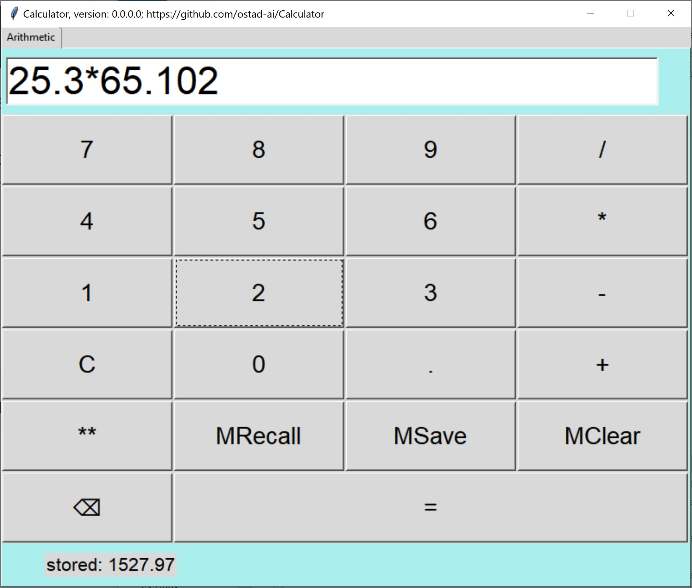

# Calculator
### Newest: version 0.0.0.0
1. A calculator to do arithmetic calcualtion.
2. It has memory keys.
3. Any key impression is notified by a beep.
## This archive includes the executable program, calculator.exe, which you should click on to run.
[Download the archive for win64](https://drive.google.com/file/d/1T7Yx-0YRDtZ_UljD4u6pup-U-DqBMRQw/view?usp=share_link)
---
 *Figure 1: A snapshot of Calculator, version 0.0.0.0, while doing operation.*
--- 
