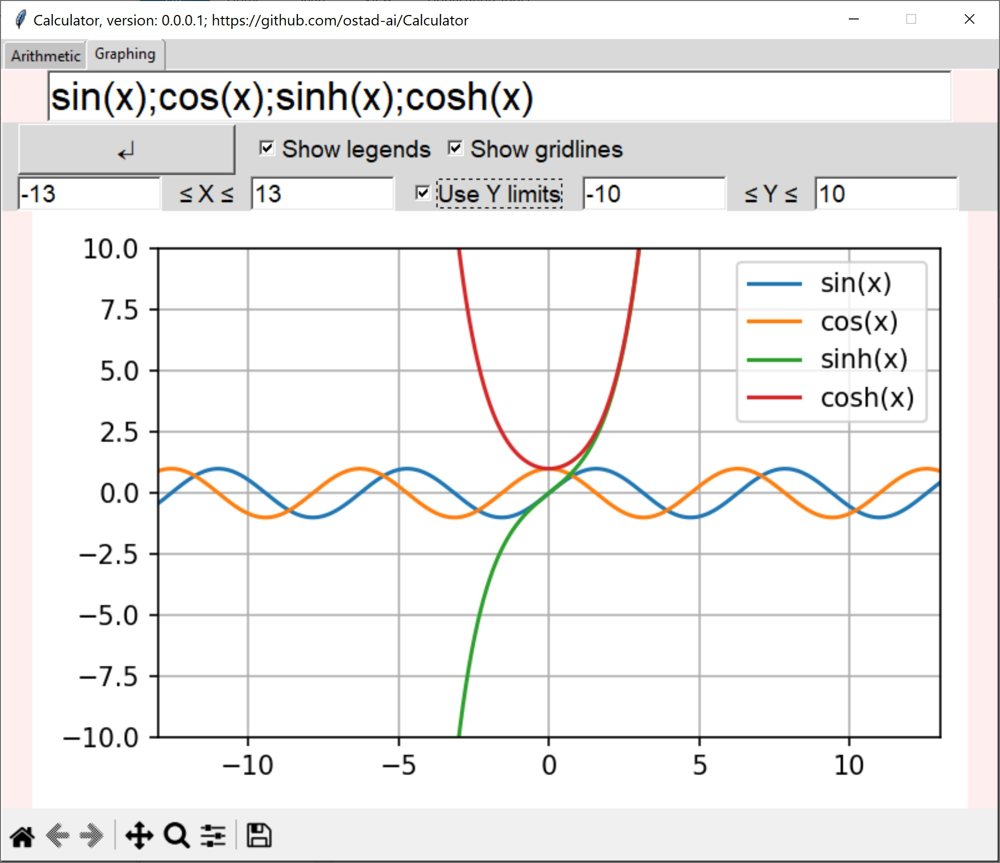
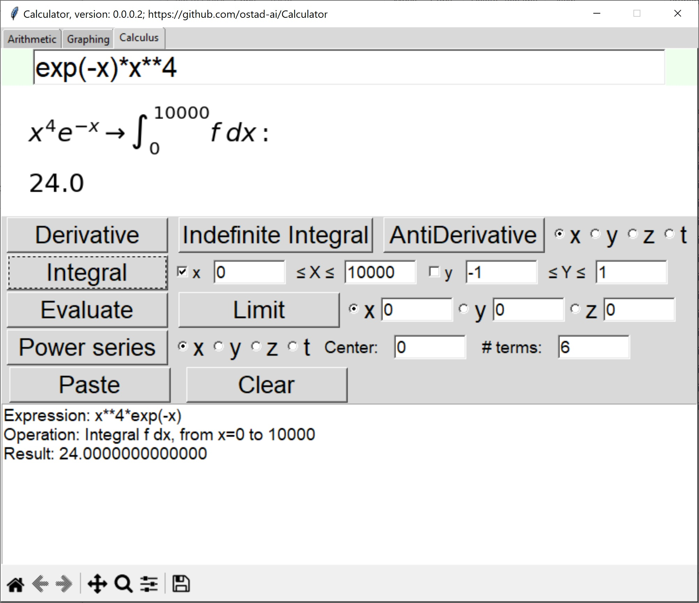

# Calculator
### Newest version 0.0.0.2
1. A new section for **calculus** has been created, which includes derivative, antiderivative, limit, definite integration, power series, and evaluation.
## This archive includes the executable program, **calculator.exe**, which you should click on to run.
[Download the archive for win64 (Windows 10)](https://drive.google.com/file/d/192nfl86V0E8jtr5OM0jsD_AMljFyTGdX/view?usp=share_link)
---
### Version 0.0.0.1
1. A graphing section is included.
2. You can save the graph by the toolbar below. 
3. You can use gridlines, or show legends, or limit *y* values.
4. You can use all *math* functions in Python, plus *gauss* and *random*.
5. You can also use *sign*, *logistic*, *relu*, *lrelu*, *elu*, *gelu*, *silu*, *softplus*, and *prelu*.
## This archive includes the executable program, **calculator.exe**, which you should click on to run.
[Download the archive for win64 (Windows 10)](https://drive.google.com/file/d/130ibv2g8XK4Po8iC05vm8s7FRnKe8Vlh/view?usp=share_link)
---
[Download the archive for win64 (Windows 7)](https://drive.google.com/file/d/1jn98jdUaf0m3ugo6mS1hQICeJ5z8Syjp/view?usp=share_link)
---
### Version 0.0.0.0
1. A calculator to do arithmetic calculations.
2. It has memory keys.
3. Any key impression is notified by a beep.

 *Figure 1: A snapshot of Calculator, version 0.0.0.0, while doing operation.*
---
 
 *Figure 2: A snapshot of Calculator, version 0.0.0.1, while doing operation.*
---
 *Figure 3: A snapshot of Calculator, version 0.0.0.2, while doing operation.*
---

